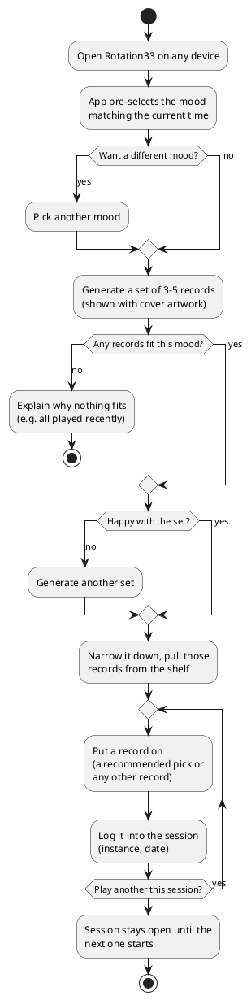
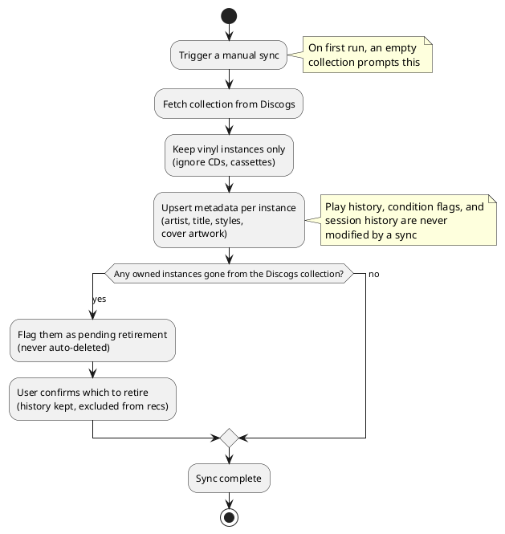

# Rotation33: Product Requirements Document

**Date:** 2026-07-15

**Status:** Draft (MVP scope)

**Related documents:** [`recommendation-engine-design.md`](/docs/rfc/recommendation-engine-design.md),
[`technical-architecture.md`](/docs/rfc/technical-architecture.md)

## 1. Overview

Rotation33 is a self-hosted web application that recommends vinyl records from a
personal collection to play throughout the day on an office nearfield audio
system. It replaces an ad hoc process (exporting a Discogs collection to CSV
and asking for recommendations conversationally) with a persistent, always
available tool on the home network that remembers what's been played and
adapts over time.

Only vinyl is in scope: any CDs, cassettes, or other formats in the Discogs
collection are ignored.

## 2. Goals

- Recommend records that fit a chosen listening mood, without repeating
  anything played too recently.
- Build a genuine listening history: what was suggested, what was actually
  played, when, and in which session.
- Let collection metadata and physical condition (damaged/unplayable copies)
  inform recommendations without manually tagging every record by hand.
- Be reachable from any device on the home network, with no login friction.
- Run entirely locally for day-to-day use, with no external API dependency
  on the daily-use path.
- Keep the recommendation logic swappable, so a more complex approach could be
  dropped in later without a rewrite.

## 3. Non-goals (MVP)

- Multi-user support or authentication: single user, trusted home LAN only.
- Any external API call in the daily-use path.
- Discogs write-back: sync is one-way, Discogs to local app only.
- Scheduled/automatic sync: sync is a manual, user-triggered action.
- Native mobile app: responsive web only.
- Automatic play detection (e.g. via smart-home hardware): logging is manual.

## 4. Success looks like

The manual CSV-export-and-ask workflow is fully retired: recommendations,
logging, and history all live in the app, and checking it becomes a normal
part of the daily routine rather than something that requires opening a chat.

## 5. Prior art

A survey of self-hosted Discogs managers, vinyl catalog apps, music-library
recommenders, and scrobble trackers found no existing tool that combines the
three things that define Rotation33: mood/time-of-day recommendation over a
Discogs catalog, recency-window avoidance, and per-physical-instance play
logging.

- Self-hosted Discogs catalogs (DiscoGraphic, DVinyl, Musivault) handle one-way
  sync and condition storage, but offer no recommendation beyond a random
  picker and log no plays.
- Scrobble trackers (Maloja, ListenBrainz) log plays, but only at track level
  and with no Discogs sync.
- Local streaming servers (LMS) come closest on mood/tag recommendation, but
  operate over local audio files rather than a vinyl catalog.
- Proprietary iOS apps (VinylRec, VinVibe, SpinStack) advertise nearly the full
  concept (validating the idea) but are closed-source, mobile-only, and not
  self-hostable.

## 6. Users

Single user, accessing the app from any device on the home network (phone,
tablet, office desktop) while operating an office nearfield audio system.

## 7. Core concepts

### Records

A **Release** is the album itself, independent of which specific copy is owned.
It is the broadest unit in the model, and recency avoidance operates at the
Release level.

An **Instance** is one specific physical copy of a Release, distinct from other
pressings of the same album. Ownership, condition, and Plays attach to an
Instance rather than to the Release.

A **Retired Instance** is an Instance that is no longer in the Discogs
collection, for example because it was sold, confirmed by the user after a sync
flags it. A Retired Instance is excluded from Recommendations but keeps its Play
history, and it un-retires if it reappears on a later sync.

Because a Release corresponds to a Discogs master release, a change to Discogs
master grouping (for example a release that later gains a master it previously
lacked) can re-key an album on a subsequent sync and may split or merge its
recency history. This is rare and accepted for the MVP.

### Moods

A **Mood** is one of a small fixed set of listening moods, and it is the starting
point for a Session. Each Mood carries a soft time-of-day default.

A **Mood Description** is an editable description of a Mood that informs its
Recommendations, and it has a built-in default.

A **Style Affinity** maps a Discogs style tag, such as Bossa Nova or Prog Rock,
to the Mood or Moods it suits. Style Affinities ship with built-in defaults and
remain editable.

The five moods are First Light, Heads Down, Peak, Golden Hour, and After Dark.
After Dark is an optional wind-down, the mood most likely to go unused on a given
day. Because each Mood carries a soft time-of-day default, the app can pre-select
the likely Mood when opened while leaving the user free to pick any Mood at any
time. The day runs as an arc: ease in, bear down, lift, ease out, and optionally
clock off. The defaults below are soft, and they only decide which Mood is
pre-selected when the app opens.

**First Light** (default 6:00 to 9:00) is coming online: low-stakes and familiar,
easy on the ears but not half-asleep. It starts the day without demanding anything
while still keeping a pulse, favoring gentle acoustic and roots, warm soul, and
mellow pop, and it skews toward records known cold. Colter Wall, Gordon Lightfoot,
Simon and Garfunkel, early Steely Dan, and Stevie Wonder fit here.

**Heads Down** (default 9:00 to 12:00) is for concentration, and it is
instrumental or near-wordless only, since lyrics pull focus. It draws on jazz,
film and game scores, and instrumental prog, holding the room without ever asking
for attention. Dave Brubeck, Art Blakey, Joe Hisaishi, and the Skyrim score fit
here.

**Peak** (default 12:00 to 15:00) is the midday high, where drive matters and
genre does not. It spans funk and groove that moves, loud and aggressive music
when it is earned, fist-in-the-air classic rock, and rowdy roots; if it raises the
pulse, it fits. Parliament, Daft Punk, Wu-Tang Clan, Run The Jewels, NOFX, Van
Halen, Queen, Tyler Childers, and Kaitlin Butts fit here.

**Golden Hour** (default 15:00 to 18:00) is the day easing out: warm, nostalgic,
and sunset-lit. It favors yacht rock, soft rock, and the wistful end of the
catalog, running slower than Peak and more sentimental than the morning, the
comedown rather than the crash. The Doobie Brothers, James Taylor, Seals and
Crofts, Dire Straits, Fleetwood Mac, and Electric Light Orchestra fit here.

**After Dark** (default 18:00 onward) is off the clock, with no work agenda, so
the moodier and darker corners open up: post-punk, late-night jazz, and brooding
singer-songwriter, whatever does not belong in daylight. It is the optional one;
some days it is never picked, and that is fine. Patti Smith, The Smiths, Lovage,
Pink Floyd, and after-hours Art Blakey fit here.

The built-in Style Affinities map common Discogs styles onto these moods, and a
style may suit more than one. First Light and Golden Hour share the collection's
mellow core, with folk, country, singer-songwriter, and soft or yacht rock suiting
both, while warm soul and mellow pop lean toward First Light and nostalgic classic
rock leans toward Golden Hour. Heads Down takes the wordless styles: cool jazz and
hard bop, soundtrack and score, ambient and modern classical, and instrumental
prog. Peak takes anything with drive: funk and P.Funk, disco, hard and arena rock,
punk and hardcore, hip hop, house, and uptempo Americana such as bluegrass and
outlaw country. After Dark takes the moodier styles: post-punk and indie rock, new
wave and synth-pop, late-night jazz, and darker art rock. A record that fits
several styles is judged on its best-fitting style for the chosen Mood (FR-8), and
any style not present in this default map is treated as eligible for all Moods and
flagged for review (FR-18).

### Sessions

A **Session** is a single listening sitting: a chosen Mood, the records generated
for it, and the records logged as played into it. A Session stays open until a
new one starts.

A **Recommendation** is a set of records generated for a Session's Mood, aiming
for three to five but showing fewer when the pool is thin rather than padding.
Each recommended record is a Release; the specific Instance is chosen when a play
is logged. It is the shelf starting point that the user narrows down from.
Because recency avoidance works at the Release level, no album recurs through a
different pressing.

A **Play** is a specific Instance logged as played, added to the current Session
on a given date.

## 8. Functional requirements

### 8.1 Collection sync
- **FR-1:** User can trigger a manual sync pulling current collection data
  (artist, title, format, year, Discogs style tags, cover artwork) from Discogs.
  Only vinyl instances are imported; other formats (CDs, cassettes) are ignored.
- **FR-2:** Sync is one-way and never alters local behavioral data: play
  history, condition flags, and session history are untouched by a sync.
- **FR-2a:** When a sync finds an instance that previously existed but is no
  longer in the Discogs collection (e.g. sold), it does not delete it. The
  instance is flagged as pending retirement and surfaced for the user to
  confirm; a partial or failed sync must not silently retire records. A
  confirmed-retired instance is excluded from recommendations but keeps its play
  history, which stays visible and still counts toward release-level recency
  (FR-4) for any other owned pressing of the same release. Matching is on the
  Discogs instance/release identity, so an instance that reappears on a later
  sync un-retires and reconnects to its existing history.

### 8.2 Starting a session
- **FR-3:** User starts a session by choosing a mood. On opening the app, the
  mood whose time-of-day default matches the current time is pre-selected; the
  user can override it with a single tap.
- **FR-4:** A session generates 3-5 recommended records for the chosen mood,
  chosen for fit against the mood and for not having been played (any pressing
  of the same release) within a configurable recency window (default 3 days). A
  thin pool may yield fewer than three; the set shows what qualifies rather than
  padding, and only a genuinely empty set triggers FR-10.
- **FR-5:** Recommendations exclude any record already logged into the active
  session. Recency-based exclusion is covered by FR-4; there is no separate
  same-day rule.
- **FR-6:** Each recommendation shows the record's cover artwork, so a
  suggestion on screen maps directly to a spine on the shelf.
- **FR-7:** Selection favors records that haven't played in the longest time,
  while still giving variety from session to session rather than a fixed ranking.
- **FR-8:** A record that fits several styles is judged on its best-fitting
  style for the chosen mood; it isn't penalized for also carrying an unrelated tag.

### 8.3 Generate another set
- **FR-9:** User can request another set of picks for the current mood if
  unsatisfied. A new set never repeats a record played within the recency
  window, already logged into the active session, or already shown and passed
  over earlier in this session.
- **FR-10:** When no records satisfy the constraints, the session says so, and
  ideally why (e.g. everything fitting this mood has played recently), rather
  than showing an empty or padded set.

### 8.4 Play logging
- **FR-11:** User logs a record as played by adding it to the current session,
  from any device on the network.
- **FR-12:** The logged record can be one of the shown recommendations or any
  other record in the collection; off-recommendation plays are logged the
  same way. (No explicit "skip" exists: a mood the user never opens, or a
  session with nothing logged, simply has no plays.)
- **FR-12a:** To log an off-recommendation play, the user can find any record in
  the collection by browsing or searching (by artist or title). Selecting a
  result logs it into the current session the same way a recommended pick is
  logged. Where a release has more than one owned instance, the user picks which
  instance played.
- **FR-12b:** The user can remove a play logged into the current session (e.g.
  wrong instance, mis-tap). Removal deletes the play outright; there is no edit.
  To fix a wrong entry, remove it and log the correct one. Removing a play
  immediately restores that release's eligibility for recommendations, since
  recency is derived from the remaining play history. Only plays in the active
  session are removable; earlier history is not editable in the MVP.

### 8.5 Condition / quality
- **FR-13:** User can mark a specific instance as currently not playable
  (e.g. damaged, warped). Such instances are excluded from all
  recommendations until manually cleared.
- **FR-13a:** A not-playable instance is excluded from recommendations (FR-13)
  but can still be logged as an off-recommendation play; the flag suppresses
  suggestions, it does not forbid logging a play the user actually performed.

### 8.6 Settings
- **FR-14:** User can adjust the recency window.
- **FR-15:** User can edit each mood's description, which starts from a built-in default.
- **FR-16:** User can edit the style-to-mood affinity mapping, which ships with built-in defaults (see FR-17).

### 8.7 Defaults and first run
- **FR-17:** The app ships with built-in defaults: a style-to-mood affinity map
  covering common Discogs styles, and starter descriptions for the five moods.
  Editing either (FR-15, FR-16) persists an override of the built-in default, so
  the app produces sensible recommendations immediately after the first sync
  with no manual setup or separate seeding step.
- **FR-18:** Styles absent from the affinity map are treated as eligible for
  all moods and flagged for review; a record is never silently excluded from
  recommendations because one of its styles is unmapped. Styles newly
  introduced by a sync are handled the same way, whether on the first sync or a
  later one.
- **FR-19:** On first use, an empty collection prompts the user to run a sync.
  There is no separate onboarding wizard: once synced, the built-in defaults and
  the FR-18 handling cover setup.

## 9. User flows

### 9.1 A listening session

### 9.2 Collection sync

## 10. Non-functional requirements

- **NFR-1:** Deployable as a Docker container alongside existing self-hosted
  services on the home network.
- **NFR-2:** No authentication; relies on the home network as the trust
  boundary. Accepted risk for MVP: any device on the LAN can reach it.
- **NFR-3:** Responsive UI usable from phone, tablet, and desktop browsers.
- **NFR-4:** All data persists locally, with no cloud dependency and no external
  API call anywhere in the daily-use path.
- **NFR-5:** Recommendation logic sits behind a stable boundary so it can be
  replaced with a different implementation later without touching the rest
  of the system.

